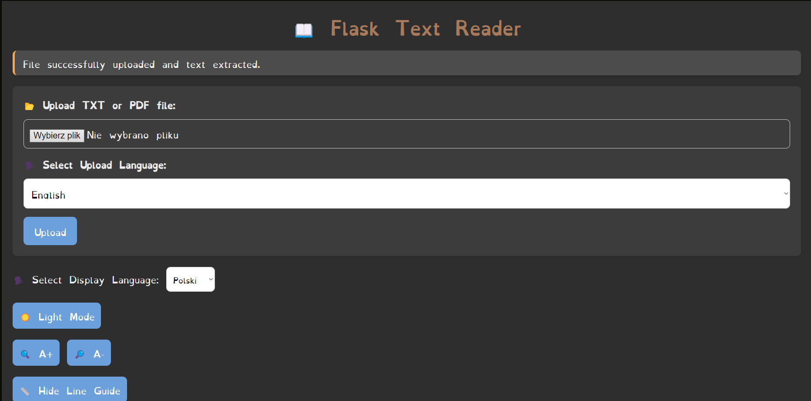
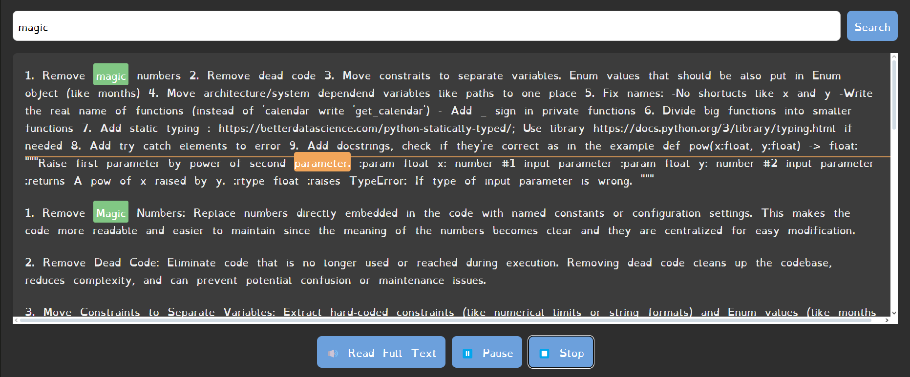
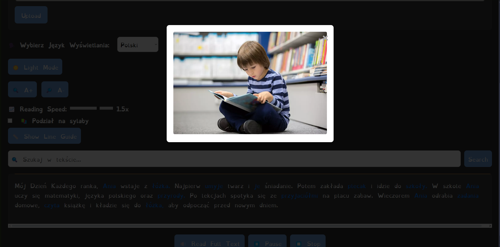

# Dyslexia-Friendly Reader Web App

## The aplication is now available on: https://dyslectic-application.onrender.com

A web application designed to assist dyslexic children in age 4-11 in reading and comprehension by providing tools like a custom dyslexia-friendly font, text-to-speech functionality, an interactive reading ruler, adjustable font sizes, robust search feature, and interactive image pop-ups to helps visualise and create memos for meaning of words. Additional feature is that, you can learn the pronunciation of words in many languages like English, Deutsch, Italiano or French.

## Table of Contents

- [Features](#features)
- [Demo](#demo)
- [Installation](#installation)
- [Usage](#usage)
- [Project Structure](#project-structure)
- [Screenshots](#screenshots)
- [Contributing](#contributing)
- [License](#license)
- [Acknowledgments](#acknowledgments)
- [Security and Privacy](#security-and-privacy)
- [Additional Notes](#additional-notes)

---

## Features

- **Custom Font Rendering**: Displays text using a dyslexia-friendly font to enhance readability.
- **Text Upload and Input**: Users can upload text files (TXT or PDF) or enter text directly into the application.
- **Text-to-Speech (TTS)**: Converts displayed text into speech, allowing users to listen to the content.
- **Interactive Reading Ruler**: A visual ruler that follows the cursor to help focus on specific lines of text.
- **Responsive Design**: Ensures compatibility across various devices and screen sizes.
- **User Settings**:
  - **Font Size Adjustment**: Increase or decrease the font size of the uploaded text for better visibility.
  - **Ruler Toggle**: Show or hide the interactive reading ruler.
- **Search Functionality**: Search for specific words within the uploaded text and highlight all matching occurrences.
- **Theme Toggle**: Switch between light and dark modes to reduce eye strain.
- **Interactive Image Pop-ups**: Clickable words trigger pop-up modals displaying relevant images to aid comprehension.
- **Division into syllables**: Helps to enhance the reading skills.
- **Accessibility Enhancements**:
  - Keyboard navigable controls.
  - ARIA attributes for screen reader compatibility.

---

## Demo

[Live Demo Link](#) *(To be added)*

---

## Installation

### Prerequisites

- **Python 3.12**
- **pip** (Python package installer)
- **Virtual Environment** (optional but recommended)

### Clone the Repository

```bash
https://github.com/Torekas/Dyslectic_application.git
cd Dyslectic_application
```

### Create a Virtual Environment (Optional)

```bash
python -m venv venv
source venv/bin/activate  # On Windows use `venv\Scripts\activate`
```

### Install Dependencies

```bash
pip install -r requirements.txt
```

### Download the Custom Font

- Download a dyslexia-friendly font like [OpenDyslexic](https://opendyslexic.org/) or use the provided `OpenDyslexic-Regular.ttf`.
- Place the font file in the `static/fonts/` directory.

### Additional Setup for Image Pop-ups

- Ensure that images corresponding to specific words are placed in the `static/images/` directory.
- Image filenames should exactly match the words they represent (case-sensitive if on a case-sensitive filesystem).

---

## Usage

### Running the Application

```bash
python app.py
```

### Accessing the Application

- Open your web browser and navigate to `http://127.0.0.1:5000/`.

### Using the Application

1. **Home Page**:
   - **Upload Text File**: Click on the **"Upload TXT or PDF file"** button to upload your text.
   - **Select Upload Language**: Choose the language corresponding to the uploaded text. Helps also to learn pronunciation!
   - **Submit**: Click the **"Upload"** button to process the file.

2. **Display Page**:
   - **Displayed Text**: The uploaded text is rendered using the custom dyslexia-friendly font.
   - **Text-to-Speech**:
     - **Read Full Text**: Click the **"🔊 Read Full Text"** button to listen to the entire text.
     - **Pause/Play**: Use the **"⏸️ Pause"** button to pause or resume playback.
     - **Stop**: Click the **"⏹️ Stop"** button to halt the audio.
   - **Font Size Adjustment**:
     - **Increase Font Size**: Click the **"🔍 A+"** button to enlarge the text.
     - **Decrease Font Size**: Click the **"🔎 A-"** button to reduce the text size.
   - **Theme Toggle**: Switch between light and dark modes using the **"🌙 Dark Mode"** button.
   - **Interactive Reading Ruler**:
     - **Show/Hide Ruler**: Toggle the reading ruler with the **"📏 Show Line Guide"** button.
     - **Ruler Behavior**: The ruler follows your cursor to aid in line-by-line reading.
   - **Search Functionality**:
     - **Search Bar**: Enter a word in the search input and click **"Search"** to highlight all occurrences.
     - **Search Feedback**: View messages indicating the number of matches found or if no matches exist.
   - **Interactive Image Pop-ups**:
     - **Click on Visualizable Words**: Click on specific words to open a modal pop-up displaying relevant images to aid comprehension.

---

## Project Structure

```
dyslexia-friendly-reader/
├── app.py
├── requirements.txt
├── templates/
│   ├── index.html
├── static/
│   ├── css/
│   │   └── styles.css
│   ├── js/
│   │   └── scripts.js
│   ├── fonts/
│   │   └── OpenDyslexic-Regular.ttf
│   └── images/
│       ├── Ania.png
│       ├── łóżka.png
│       ├── umyje.png
│       ├── je.png
│       ├── plecak.png
│       ├── szkoły.png
│       ├── przyrody.png
│       ├── przyjaciółmi.png
│       ├── zadania.png
│       ├── czyta.png
│       └── ... inne obrazki ...
└── README.md
```

- **app.py**: The main Flask application file handling backend logic.
- **requirements.txt**: Lists all Python dependencies required for the project.
- **templates/**: Contains HTML templates for the application.
  - **index.html**: The main page template.
- **static/**: Contains static files like CSS, JavaScript, fonts, and images.
  - **css/styles.css**: Stylesheet for the application.
  - **js/scripts.js**: JavaScript file managing interactivity and functionalities.
  - **fonts/OpenDyslexic-Regular.ttf**: Custom dyslexia-friendly font.
  - **images/**: Contains images used in the application for visualizable words.
- **README.md**: Project documentation.

---

## Screenshots

### Home Page



### Display Page with Reading Ruler and Image Pop-up





---

## Contributing

Contributions are welcome! Please follow these steps:

1. **Fork the repository**.
2. **Create a new branch**:

    ```bash
    git checkout -b feature/YourFeature
    ```

3. **Make your changes**.
4. **Commit your changes**:

    ```bash
    git commit -m "Add YourFeature"
    ```

5. **Push to the branch**:

    ```bash
    git push origin feature/YourFeature
    ```

6. **Open a pull request**.

Please ensure your contributions adhere to the existing code style and include relevant tests where applicable.

---

## License

This project is licensed under the [MIT License](LICENSE).

---

## Acknowledgments

- **OpenDyslexic Font**: For creating a font designed to increase readability for readers with dyslexia.
- **Flask**: For the robust and lightweight web framework.
- **gTTS**: For enabling text-to-speech functionality.
- **PyPDF2**: For extracting text from PDF files.
- **Font Awesome**: For the icons used in the application.
- **Google Fonts**: For providing a variety of high-quality fonts.
- **Bootstrap**: For facilitating responsive design (if used).
- **Micromodal**: For lightweight modal implementations.

---

## Security and Privacy

- **Sensitive Data**: Ensure that no sensitive data (like secret keys or API keys) are committed to the repository. Use environment variables or configuration files (excluded from version control) to manage sensitive information.
- **User Data**: Uploaded text files are temporarily stored and processed. They are deleted after processing to protect user privacy. Ensure that no personally identifiable information (PII) is inadvertently stored or exposed.
- **Dependencies**: Regularly update dependencies to patch known vulnerabilities. Use tools like `pip-audit` or `safety` to scan for insecure packages.

---

## Additional Notes

- **Environment Variables**: For production deployments, consider using environment variables to manage configuration settings securely.
- **Scalability**: Implement background task queues (e.g., Celery) for handling intensive tasks like large file processing or TTS generation.
- **Error Handling**: Enhance error handling to provide more user-friendly messages and log errors for debugging.
- **Accessibility**: Continue to prioritize accessibility by adhering to WCAG guidelines and conducting user testing with individuals who have dyslexia.
- **Ollama Implementation**: We are currently working on integrating the Ollama AI model into our app to dynamically generate images based on selected words. This feature will be available in the next release.
- **Lazy Loading Images**: To improve performance, especially with a large number of images, consider implementing lazy loading techniques.
- **Modal Animations**: Add subtle animations to modal pop-ups for a smoother user experience.

---

