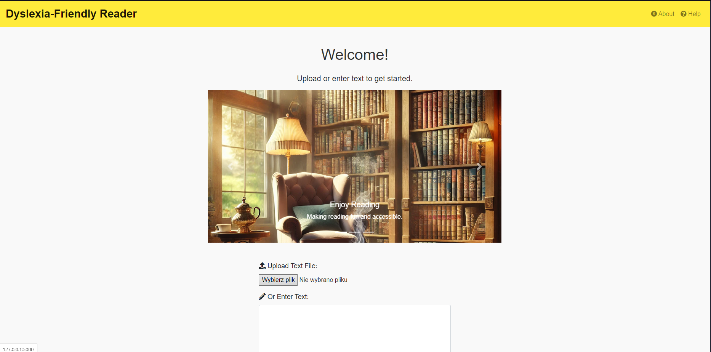
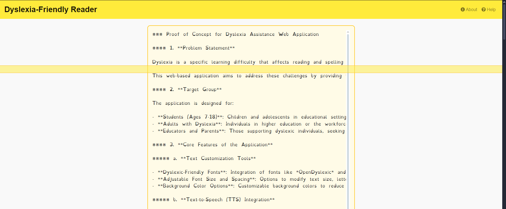

# Dyslexia-Friendly Reader Web App

A web application designed to assist dyslexic children in reading and comprehension by providing tools like a custom dyslexia-friendly font, text-to-speech functionality, and an interactive reading ruler.

## Table of Contents

- [Features](#features)
- [Demo](#demo)
- [Installation](#installation)
- [Usage](#usage)
- [Project Structure](#project-structure)
- [Screenshots](#screenshots)
- [Contributing](#contributing)
- [License](#license)
- [Acknowledgments](#acknowledgments)

---

## Features

- **Custom Font Rendering**: Displays text using a dyslexia-friendly font to enhance readability.
- **Text Upload and Input**: Users can upload text files or enter text directly into the application.
- **Text-to-Speech**: Converts displayed text into speech, allowing users to listen to the content.
- **Interactive Reading Ruler**: A visual ruler that follows the cursor to help focus on specific lines of text.
- **Responsive Design**: Built with Bootstrap to ensure compatibility across various devices and screen sizes.
- **User Settings**: Allows adjustment of font size, ruler height, and toggling of the reading ruler.

---

## Demo

[Live Demo Link](#) (To be added)

---

## Installation

### Prerequisites

- **Python 3.x**
- **pip** (Python package installer)
- **Virtual Environment** (optional but recommended)

### Clone the Repository

```bash
git clone https://github.com/your-username/dyslexia-friendly-reader.git
cd dyslexia-friendly-reader
```

### Create a Virtual Environment (Optional)

```bash
python -m venv venv
source venv/bin/activate  # On Windows use `venv\Scripts\activate`
```

### Install Dependencies

```bash
pip install -r requirements.txt
```

### Download the Custom Font

- Download a dyslexia-friendly font like [OpenDyslexic](https://opendyslexic.org/) or use the provided `CustomFont.ttf`.
- Place the font file in the `static/fonts/` directory.

---

## Usage

### Running the Application

```bash
python app.py
```

### Accessing the Application

- Open your web browser and navigate to `http://127.0.0.1:5000/`.

### Using the Application

1. **Home Page**: Upload a text file or enter text manually.
2. **Display Page**:
   - The text will be displayed using the custom dyslexia-friendly font.
   - Use the **Listen** button to hear the text read aloud.
   - Adjust settings using the **Settings** button:
     - Change font size.
     - Modify the reading ruler's height.
     - Toggle the reading ruler on or off.

---

## Project Structure

```
dyslexia-friendly-reader/
├── app.py
├── requirements.txt
├── templates/
│   ├── base.html
│   ├── index.html
│   ├── display.html
│   ├── about.html
│   └── help.html
├── static/
│   ├── css/
│   │   └── styles.css
│   ├── js/
│   │   └── script.js
│   ├── fonts/
│   │   └── CustomFont.ttf
│   └── images/
│       ├── reading1.jpg
│       ├── reading2.jpg
│       └── reading3.jpg
```

- **app.py**: The main Flask application file.
- **templates/**: Contains HTML templates for the application.
- **static/**: Contains static files like CSS, JavaScript, fonts, and images.
- **requirements.txt**: Lists all Python dependencies.

---

## Screenshots

### Home Page



### Display Page with Reading Ruler



---

## Contributing

Contributions are welcome! Please follow these steps:

1. **Fork the repository**.
2. **Create a new branch**:

   ```bash
   git checkout -b feature/YourFeature
   ```

3. **Make your changes**.
4. **Commit your changes**:

   ```bash
   git commit -m "Add YourFeature"
   ```

5. **Push to the branch**:

   ```bash
   git push origin feature/YourFeature
   ```

6. **Open a pull request**.

---

## License

This project is licensed under the [MIT License](LICENSE).

---

## Acknowledgments

- **Bootstrap**: For providing the responsive design framework.
- **OpenDyslexic Font**: For creating a font designed to increase readability for readers with dyslexia.
- **Flask**: For the web framework.
- **gTTS**: For text-to-speech functionality.
- **Font Awesome**: For icons used in the application.

---

## Security and Privacy

- **Sensitive Data**: Ensure that no sensitive data (like API keys or service account credentials) are committed to the repository.
- **Environment Variables**: Use environment variables or configuration files (not tracked by Git) to store sensitive information.

---
